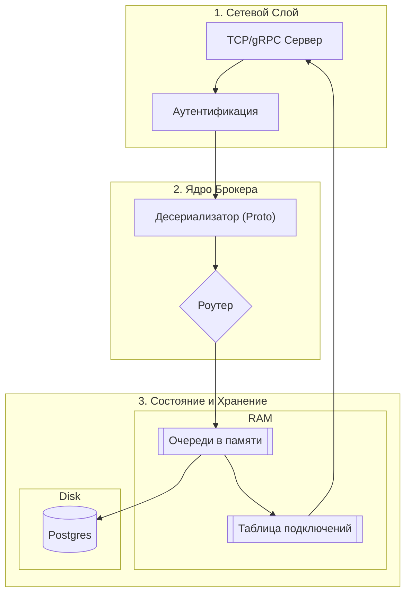
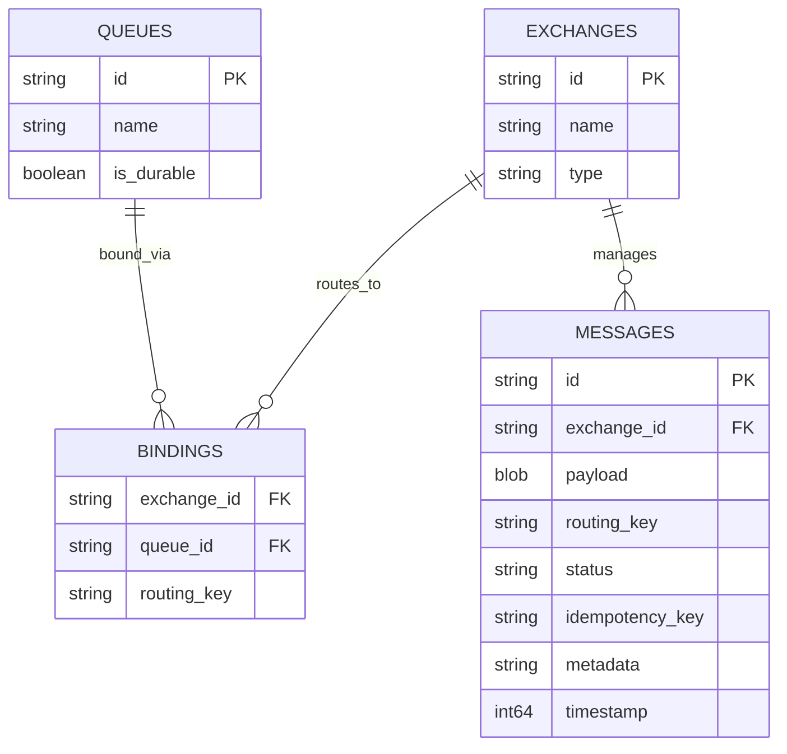

# Разработка брокера сообщений (Protobuf Over TCP)
## Обзор проекта
Цель проекта — разработка легковесного брокера сообщений для организации асинхронного взаимодействия между микросервисами. Система реализует классическую модель маршрутизации через точки обмена (Exchanges) и очереди (Queues).

## Архитектура системы
Networking Layer (TCP Server): Принимает входящие соединения, отвечает за хендшейк и чтение байтов из сокета.

Protocol Parser (Protobuf): Десериализует байты в типизированные объекты (Frame).

Exchange Router: «Мозги» системы. Принимает сообщение и, согласно таблице маршрутизации (Bindings), определяет, в какие очереди его направить.

Queue Manager: Управляет жизненным циклом очередей в оперативной памяти и порядком выдачи сообщений (FIFO).

Persistence Layer (PostgreSQL): Отвечает за транзакционную запись сообщений и хранение конфигурации (топики, привязки).

Delivery Service: Следит за отправкой сообщений активным подписчикам и ожидает подтверждения (ACK).

## Схема архитектуры



## Формат сообщения
``` proto
syntax = "proto3";

message Message {
  string id = 1;          
  string routing_key = 2;
  bytes payload = 3;      
  int64 timestamp = 4;  
  map<string, string> metadata = 5;
}
```

## Структура БД


## Технический стек
| Технология | Выбор | Обоснование |
| ---------- | ------| ------------|
| Язык | Python 3.12 | Высокая скорость разработки логики брокера и отличная поддержка asyncio.|
| Сетевой слой | Asyncio Streams | Позволяет эффективно обрабатывать тысячи конкурентных TCP-соединений на одном ядре. |
| Протокол | Protobuf | Бинарный формат быстрее и компактнее JSON. Легко генерировать SDK для разных ЯП. |
| База данных | PostgreSQL | Поддержка транзакций (ACID) критична для гарантии доставки. Инструменты типа SKIP LOCKED упрощают работу с очередями. |

## План разработки

### Протокол и Транспорт:

- Описание всех .proto фреймов (Connect, Publish, Subscribe, Ack).

- Создание базового TCP-сервера, который "эхом" отвечает на Protobuf-сообщения.

### Маршрутизация и Память:

- Реализация Exchange и Queue в оперативной памяти.

- Логика распределения сообщений между подписчиками (Round Robin).

### Персистентность:

- Интеграция Postgres.

- Реализация записи сообщения в БД перед отправкой ACK паблишеру.

- Механизм восстановления очереди из БД при старте сервера.

### Клиентское SDK и Тесты:

- Написание Python-библиотеки для удобной работы с брокером.

- Создание Docker-compose окружения с тремя тестовыми сервисами.
