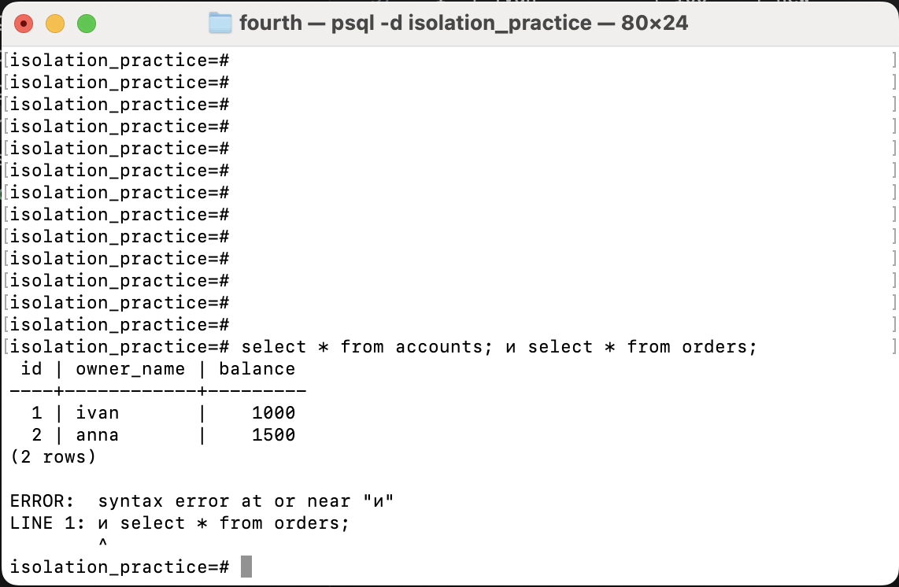
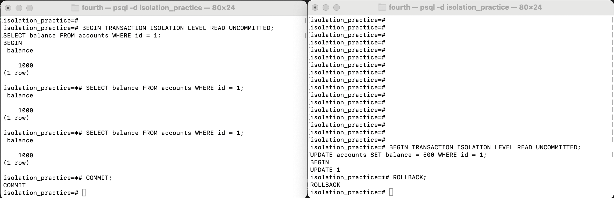
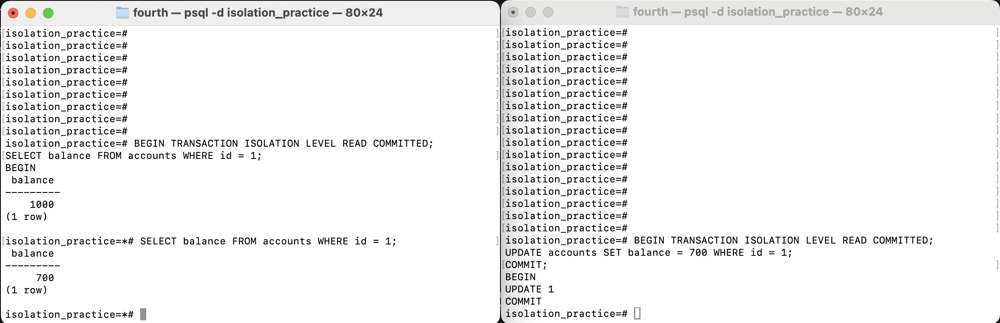
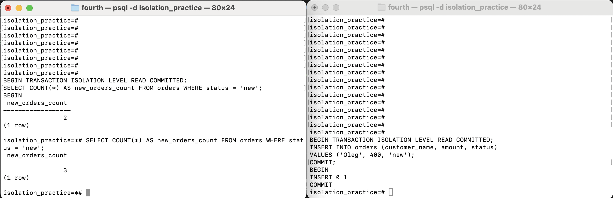
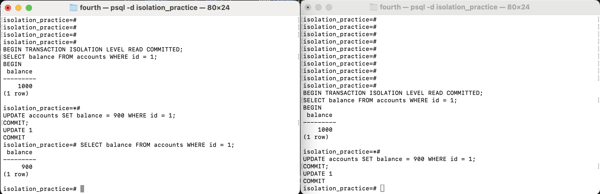

# отчет по практике аномалии изоляции в sql

## 1 цель работы

цель работы показать на практике что при параллельной работе с бд могут появляться аномалии изоляции транзакций

для работы я выбрал postgresql. примеры запускаются в двух разных подключениях к базе, я назвал их `session a` и `session b`

важно что в postgresql dirty read нормально воспроизвести нельзя. даже если написать `read uncommitted`, postgres все равно не показывает незакоммиченные данные. поэтому в этом пункте показано что эта аномалия в postgres не проходит

## 2 подготовка базы

скрипт для подготовки находится в файле `01_schema.sql`

он создает две таблицы

- `accounts` - счета
- `orders` - заказы

запуск через psql

```bash
createdb isolation_practice
psql -d isolation_practice -f 01_schema.sql
```

начальные данные

```text
accounts
id | owner_name | balance
1  | ivan       | 1000
2  | anna       | 1500

orders
id | customer_name | amount | status
1  | ivan          | 100    | new
2  | anna          | 200    | new
3  | petr          | 300    | paid
```

скриншот подготовки данных



## 3 dirty read

скрипт `02_dirty_read.sql`

dirty read это чтение данных которые другая транзакция еще не сохранила

шаги

1. в `session a` начинается транзакция с уровнем `read uncommitted`
2. `session a` читает баланс счета `id = 1`, получается `1000`
3. в `session b` тоже начинается транзакция с уровнем `read uncommitted`
4. `session b` меняет баланс на `500`, но `commit` не делает
5. `session a` снова читает баланс
6. получается `1000`, а не `500`
7. `session b` делает `rollback`

результат

```text
первое чтение в session a: 1000
после update в session b без commit: 1000
после rollback в session b: 1000
```

вывод: postgresql не дает прочитать значение `500`, потому что оно не было сохранено. то есть dirty read тут не воспроизводится

скриншот



как избежать

в postgresql это уже предотвращается самой субд. можно использовать обычный `read committed` или уровень выше

## 4 non repeatable read

скрипт `03_non_repeatable_read.sql`

non repeatable read это когда в одной транзакции читаем одну и ту же строку два раза и получаем разные значения

шаги

1. `session a` на уровне `read committed` начинает транзакцию и читает баланс `id = 1`, получается `1000`
2. `session b` меняет этот баланс на `700` и делает `commit`
3. `session a` снова читает эту же строку и получает `700`

результат

```text
первое чтение в session a: 1000
после commit в session b: 700
```

вывод: в одной транзакции получились разные значения одной строки

скриншот



как избежать

можно использовать уровень `repeatable read`, тогда внутри одной транзакции будет один снимок данных

## 5 phantom read

скрипт `04_phantom_read.sql`

phantom read это когда повторный запрос по условию видит новые строки

шаги

1. `session a` на уровне `read committed` начинает транзакцию и считает заказы со статусом `new`
2. первый результат `2`
3. `session b` добавляет новый заказ со статусом `new` и делает `commit`
4. `session a` повторяет тот же запрос
5. второй результат `3`

результат

```text
первый count(*) в session a: 2
после insert и commit в session b: 3
```

вывод: во втором запросе появилась новая строка, это и есть фантомное чтение

скриншот



как избежать

можно использовать `repeatable read` или `serializable`. в postgresql repeatable read не увидит новые строки из другой транзакции

## 6 lost update

скрипт `05_lost_update.sql`

lost update это потеря обновления когда две транзакции прочитали одно значение и потом записали свой результат поверх друг друга

шаги

1. `session a` читает баланс `id = 1`: `1000`
2. `session b` тоже читает этот баланс: `1000`
3. обе транзакции считают новый баланс после списания 100, получается `900`
4. `session a` записывает `900` и делает `commit`
5. `session b` тоже записывает `900` и делает `commit`
6. потом проверяем баланс

результат

```text
начальный баланс: 1000
после двух списаний по 100 итоговый баланс: 900
правильно должно быть: 800
```

вывод: одно списание потерялось потому что обе транзакции записали одно и то же заранее посчитанное значение

скриншот



как избежать

можно делать изменение одним запросом

```sql
update accounts set balance = balance - 100 where id = 1;
```

еще можно блокировать строку перед изменением

```sql
select balance from accounts where id = 1 for update;
```

также можно использовать `repeatable read` или `serializable`, тогда postgres может остановить одну из транзакций ошибкой и ее надо будет повторить

## 7 вывод

в работе были рассмотрены такие аномалии

- `dirty read` - в postgresql не воспроизводится
- `non-repeatable read` - воспроизводится на `read committed`
- `phantom read` - воспроизводится на `read committed`
- `lost update` - воспроизводится если записывать заранее посчитанное значение

аномалии появляются из-за параллельного выполнения транзакций и слабого уровня изоляции. чтобы их избежать нужно выбирать нормальный уровень изоляции, использовать блокировки и делать обновления атомарными sql запросами
